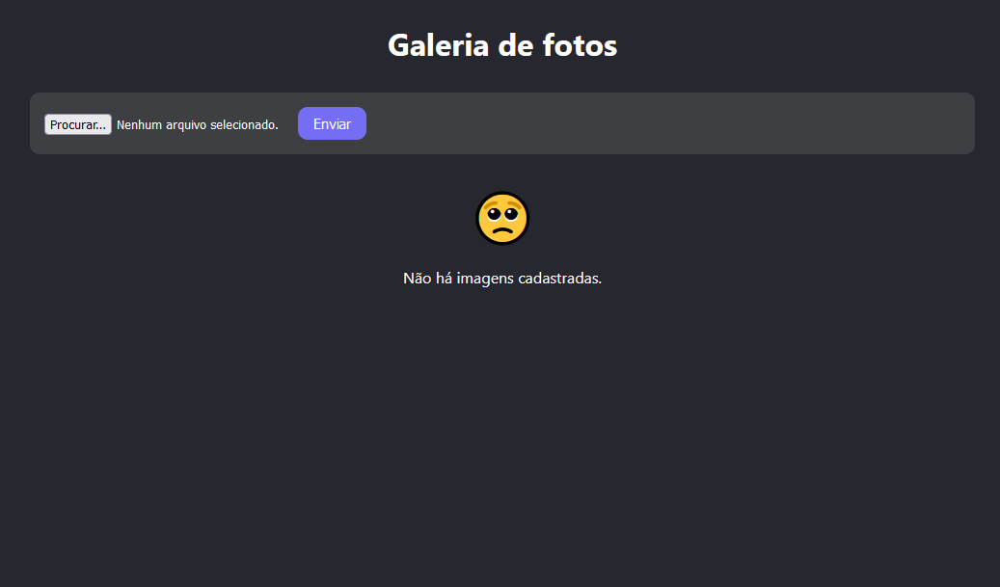

# Projeto: Galeria de imagens

Listar ou enviar imagens para o firebase

#### Material:

- React
- Typescript

#### Modo de uso:

1. Abra um terminal ( cmd/propt de comando )
2. Clone o repositório ( git clone https://github.com/RobMota/gallery_images.git )
3. Acesse a pasta ( cd gallery_images )
4. E digite os comandos abaixo:

- `npm install`
- `npm start`

### Modo responsivo:

Deixe o navegador em Responsive Design Mode ( Firefox: Ctrl + Shift + M )

### Autor original

Bonieky Lacerda

#### Vídeo do projeto no youtube

https://www.youtube.com/watch?v=ss4BXa-WfgI
