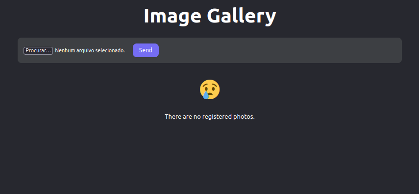

# Project: Image Gallery

Send Image to Firebase and Download Locally

#### Libs used:

- React
- Typescript
- Firebase
- Jest
- Testing Library
- Node 18

#### Use app:

1. Open the terminal ( terminal / command prompt(cmd) )
2. Clone the repository ( git clone git@github.com:RobMota/gallery_images.git )
3. Access the folder ( cd gallery_images )
4. and type de command below:

- `npm install`
- `npm run dev`

#### Use test:

- `npm run test`

### Original Author

Bonieky Lacerda

#### Video of the project on YouTube

